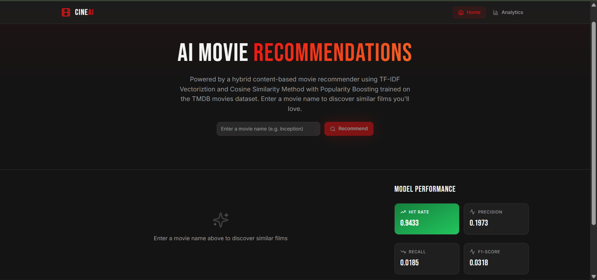
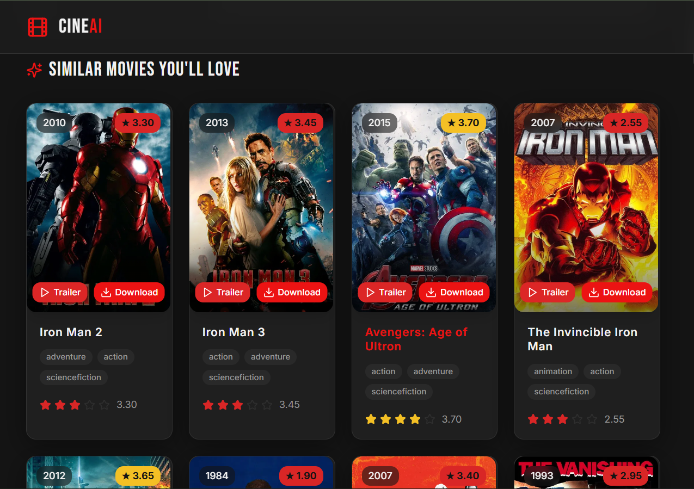
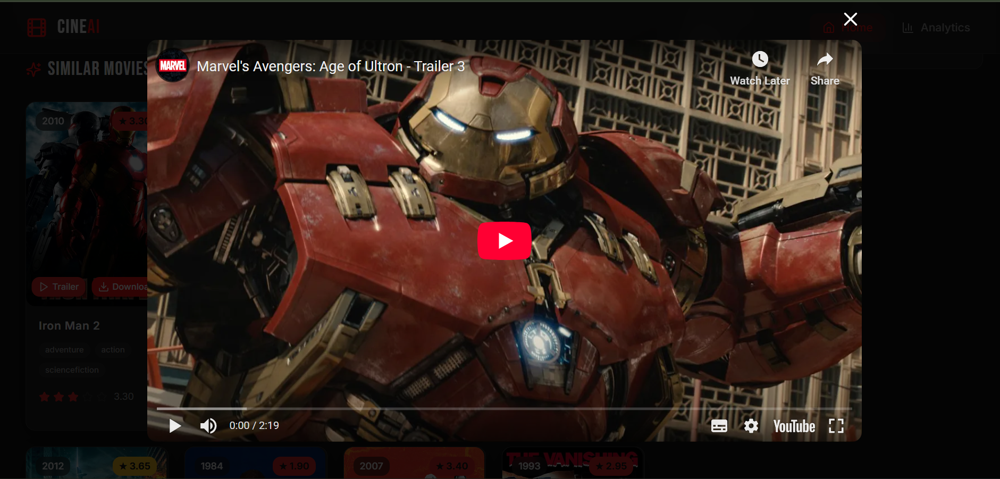

# 🎬 CinaAI – AI Based Movie Recommendation System

CinaAI is an **AI-powered movie recommendation system** that suggests movies based on user preferences using **machine learning algorithms** such as **content-based filtering and cosine similarity**.

The system analyzes movie metadata and user interactions to provide **fast, personalized recommendations** through a **modern React + Vite frontend** and a **Python-based backend**.

---

# 🚀 Features

* 🎥 AI-powered movie recommendations
* ⚡ Fast response time (~4 seconds)
* 🎞 Movie trailers preview
* ⭐ Movie rating display
* 📋 Copy movie name for download/search
* 🎯 Up to **32 personalized movie suggestions**
* 💻 Modern UI with **React + Framer Motion animations**

---

# 🧠 AI / Machine Learning Model

The recommendation engine uses:

* **Content-Based Filtering**
* **Cosine Similarity Algorithm**
* Movie metadata such as:

  * Genres
  * Keywords
  * Cast
  * Overview

This allows the system to recommend movies **similar to the user's selected movie**.

---

# 🛠 Tech Stack

### Frontend

* React
* Vite
* TypeScript
* TailwindCSS
* Framer Motion
* Lucide Icons

### Backend

* Python
* FastAPI
* Pandas
* NumPy
* Scikit-learn

### AI / ML

* Cosine Similarity
* Content-based filtering

---

# 📂 Project Structure

```
CinaAI
│
├── frontend
│   ├── components
│   ├── pages
│   ├── lib
│   └── index.tsx
│
├── backend
│   ├── recommender.py
│   ├── main.py
│   └── dataset
│
├── .github
│   └── workflows
│       └── deploy.yml
│
├── requirements.txt
├── package.json
└── README.md
```

---

# 📸 Screenshots

## Homepage



---

## Movie Recommendations



---

## Trailer Preview



---

# ⚙️ Installation

## 1️⃣ Clone Repository

```
git clone https://github.com/YOUR_USERNAME/CinaAI.git
cd CinaAI
```

---

# 💻 Run Frontend

```
cd frontend
npm install
npm run dev
```

Frontend will run on:

```
http://localhost:5173
```

---

# 🧠 Run Backend

```
cd backend
pip install -r requirements.txt
uvicorn main:app --reload
```

Backend runs on:

```
http://localhost:8000
```

---

# 📊 Model Accuracy

The system evaluates similarity scores between movies and returns the **top 32 closest matches** based on cosine similarity.

Performance optimizations include:

* Parallel processing
* Cached similarity matrices
* Optimized data preprocessing

---

# 🎯 Future Improvements

* Collaborative filtering
* User account system
* Watchlist feature
* Movie streaming integration
* Hybrid recommendation model
* Mobile app version (PWA)

---

# 👨‍💻 Author

**Nirmal**

Final Year Project
AI-Based Movie Recommendation System

---

# ⭐ Support

If you like this project:

⭐ Star the repository
🍴 Fork the project
📢 Share with others

---

# 📜 License

This project is for **educational and research purposes**.
